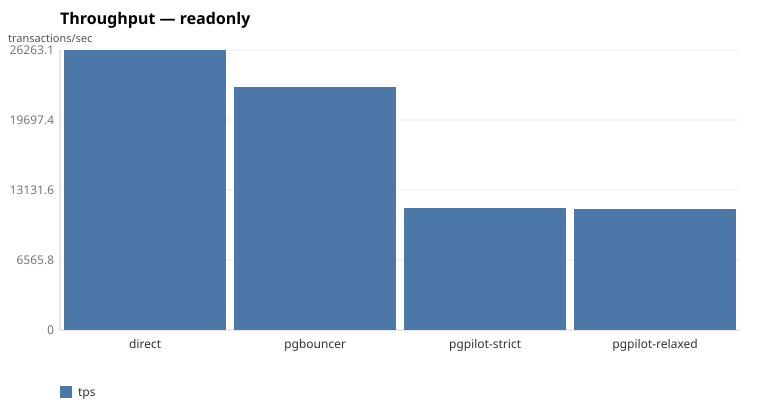
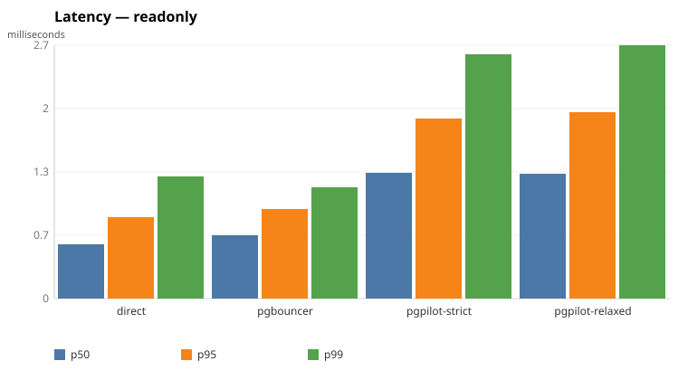

# pgpilot

> A transparent, LSN-fencing PostgreSQL connection router.

[](https://github.com/sachhg/pgpilot/actions/workflows/ci.yml)
[](LICENSE)

## The problem

Read replicas scale reads, but they lag. The moment you route a read to a
replica you risk a *read-your-writes* violation: a user updates their profile,
the next page load lands on a replica that has not yet replayed that write, and
they see stale data. The usual mitigation — "only send reads to a replica when
its lag is low" — is probabilistic. It reduces the odds of a stale read; it does
not eliminate them.

## What pgpilot is

pgpilot is a proxy that speaks the PostgreSQL wire protocol, sits between
clients and a primary/replica cluster, and routes each query to the best
backend. Its distinguishing feature is **LSN fencing**: after a write commits,
pgpilot records the primary's WAL position (LSN) as that session's fence, and a
subsequent read is only sent to a replica that has *provably replayed at or past
that LSN*. Otherwise the read falls back to the primary. This delivers
read-your-writes consistency by construction rather than by hoping replication
lag stays low.

### Consistency modes

- **strict** — always fence; a read never observes a value older than this
  session's most recent write.
- **bounded** — allow staleness up to N milliseconds.
- **relaxed** — lag-only routing, no fencing.

## Non-goals

Sharding, query rewriting, multi-master, and a GUI are explicitly out of scope.
The goal is to do one thing — correct, observable read/write routing — well.

## Status

Early development, built in phases (see the roadmap). Not production-ready yet.
pgpilot now **routes**: it authenticates each client with SCRAM-SHA-256, pools
connections, classifies each query, and sends writes to the primary and reads to
a replica — enforcing read-your-writes with a per-session LSN fence — and
balances reads across eligible replicas with a selectable routing policy
(round-robin, least-in-flight, or latency-scored), and **fails a read over** to a
healthy backend rather than dropping the client when one is down. It exposes
Prometheus metrics, per-session structured logs, and an optional pprof endpoint,
and ships a reproducible [benchmark suite](#benchmarks) comparing it to a direct
connection and to pgbouncer.

## Roadmap

| Phase | Focus                                                        | Status |
| ----: | ------------------------------------------------------------ | ------ |
|     0 | Repo hygiene, CI, licensing                                  | done   |
|     1 | Dev cluster: primary + 2 streaming replicas (docker-compose) | done   |
|     2 | Transparent proxy (byte-level passthrough)                   | done   |
|     3 | Protocol codec (typed frontend/backend messages)            | done   |
|     4 | Connection pooling (session + transaction)                  | done   |
|     5 | Query classification (read vs. write via pg_query)          | done   |
|     6 | Replica registry, health polling, circuit breakers          | done   |
|     7 | LSN fencing                                                  | done   |
|     8 | Routing policy engine                                        | done   |
|     9 | Observability (Prometheus, structured logs, pprof)          | done   |
|    10 | Fault-injection harness                                      | done   |
|    11 | Benchmarks vs. direct connection and pgbouncer              | done   |
|    12 | Docs and the v0.1.0 release                                 | next   |

## Technology

- Go 1.22+, standard library first
- [`jackc/pgx/v5/pgproto3`](https://github.com/jackc/pgx) — wire protocol codec
- [`pganalyze/pg_query_go`](https://github.com/pganalyze/pg_query_go) — the real
  Postgres parser, for query classification and feature detection. Uses v6
  rather than v5, which no longer builds on recent macOS SDKs; this makes the
  build require a C compiler (cgo).
- [`prometheus/client_golang`](https://github.com/prometheus/client_golang) —
  metrics. Pinned to v1.20.5, the newest release that keeps the module's
  `go 1.22` floor.

## Quick start

```sh
make build   # compile the binary into bin/
make test    # run tests with the race detector
make lint    # run golangci-lint
make up      # bring up the local primary + replica cluster
make smoke   # assert the cluster replicates (run after `make up`)
make itest   # assert psql through pgpilot matches psql direct, and fencing holds
make down    # tear the cluster down
```

## Development cluster

`make up` brings up a real replication topology with docker-compose: one
Postgres 16 primary and two streaming replicas (host ports 55432–55434). The
primary uses physical streaming replication with a dedicated slot per standby;
each replica bootstraps with `pg_basebackup`. Design in
[`docs/adr/0001-dev-cluster-replication.md`](docs/adr/0001-dev-cluster-replication.md).

## Running the proxy

pgpilot reads a JSON config file (see [`pgpilot.example.json`](pgpilot.example.json)):

```json
{
  "listen": "127.0.0.1:6432",
  "primary": "127.0.0.1:55432",
  "replicas": ["127.0.0.1:55433", "127.0.0.1:55434"],
  "users": [{"name": "pgpilot", "password": "pgpilot"}],
  "pool": {"mode": "session", "max_size": 10, "acquire_timeout": "5s", "idle_timeout": "5m"},
  "health": {"interval": "1s", "failure_threshold": 3, "base_backoff": "1s", "max_backoff": "30s"},
  "fencing": {"mode": "strict", "bounded_ms": 100},
  "routing": {"policy": "least-in-flight"},
  "observability": {"metrics_addr": "127.0.0.1:9090", "pprof": true}
}
```

```sh
make up
make build && ./bin/pgpilot -config pgpilot.example.json -log-level debug
psql "host=localhost port=6432 dbname=pgpilot user=pgpilot sslmode=prefer"
```

pgpilot verifies the client with SCRAM-SHA-256, then pools SCRAM-authenticated
connections to the backends, keyed by `(user, database)`. TLS is refused for now,
so clients must permit a cleartext connection (`sslmode=prefer` falls back
automatically). See
[`docs/adr/0004-auth-termination-and-pooling.md`](docs/adr/0004-auth-termination-and-pooling.md).

### Routing and LSN fencing

When `replicas` are configured, pgpilot **routes** each query: it classifies it
with `pg_query`, sends writes to the primary and reads to a replica, and pins an
explicit transaction to one backend. It enforces **read-your-writes** with a
per-session LSN fence — after a write commits on the primary, the session's fence
advances to the primary's WAL position, and a subsequent read only goes to a
replica that has replayed at or past that fence (else it falls back to the
primary). `fencing.mode` selects the trade-off:

- **`strict`** (default) — a replica serves a read only once it has replayed the
  fence.
- **`bounded`** — a replica within `bounded_ms` of lag may serve the read.
- **`relaxed`** — any healthy replica may (lag-only routing).

`make itest` includes an acceptance test that pauses replication with
`pg_wal_replay_pause()` and asserts a write followed by a read never observes a
stale value under strict mode. Design in
[`docs/adr/0008-lsn-fencing.md`](docs/adr/0008-lsn-fencing.md).

### Routing policies

Fencing decides which replicas *may* serve a read; `routing.policy` decides which
one *does* when more than one qualifies:

- **`round-robin`** — even rotation across eligible replicas.
- **`least-in-flight`** (default) — the eligible replica with the fewest reads
  outstanding, so a slow or overloaded replica sheds load until it drains.
- **`scored`** — ranks replicas by estimated completion time,
  `(inFlight + 1) * ewmaLatency(addr, shape) + lagPenalty * lag`, learning each
  query shape's cost per replica (keyed by pg_query fingerprint) so it steers
  expensive shapes away from busy replicas. It costs one fingerprint parse per
  read, which is why it is opt-in.

`go test -run WorkloadComparison -v ./internal/router` runs a deterministic
simulation comparing the policies on a synthetic mixed workload with no database.
Design in
[`docs/adr/0009-routing-policy-engine.md`](docs/adr/0009-routing-policy-engine.md).

### Observability

Set `observability.metrics_addr` to serve Prometheus metrics at `/metrics` (and,
with `"pprof": true`, the `net/http/pprof` handlers) on a dedicated HTTP server.
The exported metrics cover:

- client sessions (opened, closed, active) and pool saturation (idle/in-use
  connections and waiters per backend);
- routing decisions by `target` and `reason`, fence fallbacks, and read
  failovers;
- query latency as a histogram per target (so p50/p95/p99 come from
  `histogram_quantile`);
- per-backend health and replication lag (bytes and seconds);
- the Go runtime and process (goroutines, memory, CPU, open FDs).

Every routing decision is also logged at debug with its session id. A ready-made
Grafana overview is checked in at
[`grafana/pgpilot-dashboard.json`](grafana/pgpilot-dashboard.json). Design in
[`docs/adr/0010-observability.md`](docs/adr/0010-observability.md).

### Resilience

When a routed read cannot reach its chosen replica — the backend is down, or a
pooled connection was severed — pgpilot **fails the read over** to the next
eligible replica and finally to the primary, rather than dropping the client. The
retry is invisible because it happens before any response byte is streamed;
writes and in-transaction statements have no healthy alternative and are not
retried, and a fault that strikes mid-response drops, as it must. Every failover
increments `pgpilot_read_failovers_total`.

A test-only in-process fault injector (`internal/faultproxy`) blackholes, severs,
or slows a backend, and the integration suite asserts the invariants: no read
dropped while a healthy backend exists, no read lost to a severed connection, no
stale read in strict mode under fault, and no connection or goroutine leak.
Design in
[`docs/adr/0012-fault-tolerance.md`](docs/adr/0012-fault-tolerance.md).

### Health and replication lag

A background poller (`internal/registry`) tracks each backend's role and
replication lag (bytes and seconds) and trips a per-backend circuit breaker with
exponential backoff when a backend stops responding. `SIGHUP` reloads the replica
set without a restart. See
[`docs/adr/0007-replica-registry-and-health.md`](docs/adr/0007-replica-registry-and-health.md).

### Pool modes

`pool.mode` is `session` (a client holds one backend for its session) or
`transaction` (a backend returns to the pool between transactions), with
`pg_query`-based pinning of sessions that use a feature transaction pooling would
break. See
[`docs/adr/0005-transaction-pooling-and-feature-detection.md`](docs/adr/0005-transaction-pooling-and-feature-detection.md).

## Benchmarks

A reproducible suite compares pgpilot against a **direct** connection to the
primary and against **pgbouncer** (transaction pooling), using a custom
read-heavy load generator (`cmd/loadgen`) for throughput and true percentiles
plus standard **pgbench** (TPC-B) as a baseline. Bring up the stack and run it:

```sh
make up          # the cluster
make bench-up    # pgbouncer on :6433
make bench-suite # runs the matrix, writes bench/results/
```

Methodology and the rationale are in
[`docs/adr/0011-benchmark-methodology.md`](docs/adr/0011-benchmark-methodology.md);
raw results and charts land in [`bench/results/`](bench/results/).

### Read the caveat first

These are **single-machine** numbers: the primary and both replicas share the
same CPU, so they **cannot** show the horizontal read-scaling win that separate
replica hardware would give. They isolate two things instead — the cost of the
proxy hop and routing, and how the read-your-writes fence behaves under writes.
This is where pgpilot *loses*, published plainly.

### Results

Reference run on an Apple M3 Pro (11 cores, 18 GB), Postgres 16 and
edoburu/pgbouncer 1.24.1 in Docker, 16 connections, 20 s per cell.

**Read-only** (point SELECTs; pgpilot routes every read to a replica):

| target | tps | p50 | p95 | p99 |
| --- | ---: | ---: | ---: | ---: |
| direct | 26,263 | 582µs | 867µs | 1.30ms |
| pgbouncer | 22,874 | 681µs | 955µs | 1.19ms |
| pgpilot (strict) | 11,462 | 1.34ms | 1.92ms | 2.60ms |
| pgpilot (relaxed) | 11,433 | 1.33ms | 1.99ms | 2.69ms |

**Read-heavy mixed** (20% point UPDATEs). The fence-fallback column is the share
of reads pgpilot sent to the primary for read-your-writes:

| target | tps | p50 | p95 | p99 | fence-fallback |
| --- | ---: | ---: | ---: | ---: | ---: |
| direct | 19,566 | 603µs | 2.09ms | 2.93ms | — |
| pgbouncer | 16,160 | 792µs | 2.03ms | 2.63ms | — |
| pgpilot (strict) | 8,879 | 1.53ms | 3.40ms | 4.74ms | **99.8%** |
| pgpilot (relaxed) | 8,850 | 1.54ms | 3.43ms | 4.62ms | — |

**pgbench** (TPC-B, write-heavy — WAL/fsync-bound, so pooling matters little):

| target | tps | latency avg |
| --- | ---: | ---: |
| direct | 1,793 | 8.92ms |
| pgbouncer | 1,543 | 10.37ms |
| pgpilot (strict) | 1,253 | 12.76ms |





### What the numbers say

- **pgpilot costs throughput.** On this hardware it serves reads at roughly half
  a direct connection and below pgbouncer: every query is parsed and classified,
  reads take an extra network hop, and each write costs a `pg_current_wal_lsn()`
  round-trip to advance the fence. That is the price of routing and
  read-your-writes, and here — with no separate replica hardware to offload onto
  — there is no throughput upside to offset it.
- **Strict fencing is visible.** Under 20% writes, ~99.8% of reads fall back to
  the primary: read-your-writes, working as designed, keeps a session from
  reading behind its own write. `relaxed` keeps those reads on the replicas, at
  the cost of possible staleness — the same throughput here only because pgpilot
  is proxy-bound, not backend-bound, at this concurrency.
- **Against pgbouncer**, the honest comparison, pgpilot is slower by the work it
  does that pgbouncer does not: classify every statement, route it, and fence.
  pgpilot's bet is that read scaling and read-your-writes are worth that overhead
  on real replica hardware — which this single-box benchmark deliberately does
  not measure.

## License

[MIT](LICENSE)
