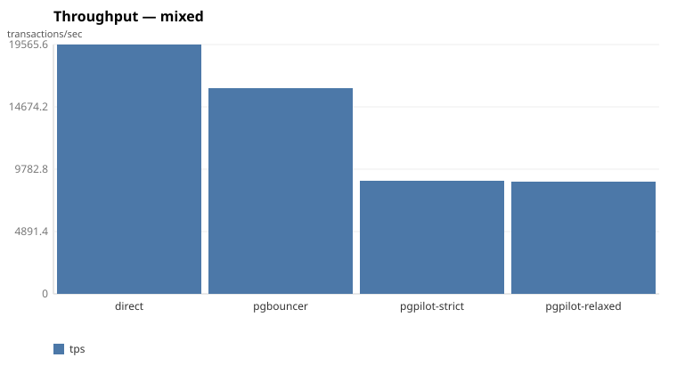
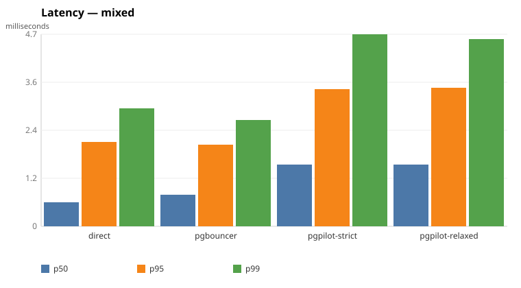

# Benchmark results

## mixed

| target | tps | p50 | p95 | p99 | fence-fallback |
| --- | ---: | ---: | ---: | ---: | ---: |
| direct | 19566 | 600µs | 2.09ms | 2.93ms | — |
| pgbouncer | 16160 | 790µs | 2.03ms | 2.63ms | — |
| pgpilot-strict | 8879 | 1.53ms | 3.4ms | 4.74ms | 99.8% |
| pgpilot-relaxed | 8850 | 1.54ms | 3.43ms | 4.62ms | — |

## readonly

| target | tps | p50 | p95 | p99 | fence-fallback |
| --- | ---: | ---: | ---: | ---: | ---: |
| direct | 26263 | 580µs | 870µs | 1.3ms | — |
| pgbouncer | 22874 | 680µs | 950µs | 1.19ms | — |
| pgpilot-strict | 11462 | 1.34ms | 1.92ms | 2.6ms | — |
| pgpilot-relaxed | 11433 | 1.33ms | 1.99ms | 2.69ms | — |

