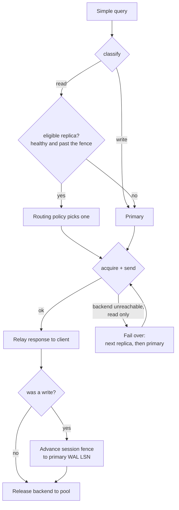

# pgpilot architecture

pgpilot is a transparent PostgreSQL proxy that routes reads to replicas without
serving a stale read of a session's own write. It speaks the PostgreSQL wire
protocol, authenticates each client, pools authenticated backend connections,
classifies every query, and routes it — enforcing read-your-writes with a
per-session LSN fence.

This document maps the components and traces a request through them. Each design
decision has an [ADR](adr/); they are indexed in [`docs/adr/README.md`](adr/README.md).

## Components

| Package | Responsibility |
| --- | --- |
| `cmd/pgpilot` | Entry point: load config, build the manager/registry/policy/metrics, serve the proxy and the metrics endpoint, reload on `SIGHUP`. |
| `internal/proxy` | The client-facing server and per-session state machine: TLS refusal, SCRAM auth, per-query classification, routing, fencing, and failover. |
| `internal/protocol` | Wire-message framing and the transaction-status tracker, over `pgproto3`. |
| `internal/scram` | SCRAM-SHA-256, both the server side (verify clients) and the client side (authenticate to backends). |
| `internal/backend` | `Manager` of per-`(user, database, address)` connection pools; a `Conn` is a SCRAM-authenticated backend connection. |
| `internal/pool` | A bounded, health-checked connection pool with backpressure and idle reaping. |
| `internal/config` | JSON configuration: listen/primary/replicas/users, pool, health, fencing, routing, observability. |
| `internal/classify` | Read-vs-write classification from the pg_query parse tree, plus query fingerprints. |
| `internal/detect` | Detection of features that break transaction pooling (temp tables, `LISTEN`, session GUCs, prepared statements). |
| `internal/registry` | Background health poller: per-backend role, replication lag, and a circuit breaker. |
| `internal/router` | The routing policy — round-robin, least-in-flight, or latency-scored — that picks among eligible replicas. |
| `internal/metrics` | Prometheus instrumentation and the scrape-time state collector. |
| `internal/faultproxy` | Test-only TCP fault injector (blackhole, sever, latency). |
| `internal/bench` | Benchmark harness: workload runner, statistics, and SVG charts. |

## Session lifecycle

```mermaid
sequenceDiagram
    participant C as Client
    participant P as pgpilot
    participant B as Backend (primary/replica)

    C->>P: SSLRequest
    P-->>C: 'N' (TLS refused)
    C->>P: StartupMessage (user, database)
    P->>C: SCRAM-SHA-256 challenge
    C->>P: SCRAM proof
    P-->>C: AuthenticationOk, ReadyForQuery
    Note over P: Client authenticated; no backend held yet
    loop each simple query
        C->>P: Query
        Note over P: classify, choose target, fence check
        P->>B: acquire pooled conn (SCRAM), forward query
        B-->>P: rows … ReadyForQuery
        P-->>C: rows … ReadyForQuery
        Note over P: on write commit, advance the fence
    end
    C->>P: Terminate
    Note over P: backend returned to the pool, not closed
```

pgpilot authenticates the client itself and holds no backend connection until the
first query, so idle clients cost no backend. Rationale:
[ADR 0002](adr/0002-transparent-proxy-ssl-refusal.md),
[ADR 0004](adr/0004-auth-termination-and-pooling.md).

## Per-query routing

When replicas are configured, each simple query outside a transaction is routed;
an explicit transaction, the extended protocol, or a session-state statement pins
the session to one backend.



- **Classification** is from the parse tree, never string matching: data-modifying
  CTEs, row locks, volatile functions, and `EXPLAIN ANALYZE` all resolve to write.
  [ADR 0006](adr/0006-query-classification.md).
- **Fencing** decides when a replica may serve a read. After a write commits, the
  session's fence advances to the primary's WAL position; a later read only goes
  to a replica that has replayed at or past it. `strict` fences exactly, `bounded`
  allows N ms of lag, `relaxed` is lag-only. [ADR 0008](adr/0008-lsn-fencing.md).
- **The routing policy** chooses among eligible replicas by rotation, in-flight
  load, or a latency score keyed by query fingerprint.
  [ADR 0009](adr/0009-routing-policy-engine.md).
- **Failover**: a read whose backend is unreachable retries on another eligible
  replica and then the primary, before any byte reaches the client; writes and
  mid-response faults are not retried. [ADR 0012](adr/0012-fault-tolerance.md).

## Pooling and health

Backends are pooled per `(user, database, address)`, each connection
SCRAM-authenticated. `pool.mode` is `session` (a client holds a backend for its
whole session) or `transaction` (a backend returns between transactions, with
pg_query-based pinning of sessions that use a pooling-breaking feature).
[ADR 0005](adr/0005-transaction-pooling-and-feature-detection.md).

A background registry polls each backend for its role and replication lag and
trips a per-backend circuit breaker on failure; `SIGHUP` reloads the replica set
live. [ADR 0007](adr/0007-replica-registry-and-health.md).

## Observability

When `observability.metrics_addr` is set, pgpilot serves Prometheus metrics
(sessions, routing decisions, fence fallbacks, read failovers, per-target query
latency, per-backend lag and pool saturation) and, optionally, `pprof`. Every
routing decision is logged at debug with a session id.
[ADR 0010](adr/0010-observability.md).

## Deployment

A multi-stage [`Dockerfile`](../Dockerfile) builds pgpilot (cgo, for pg_query) and
[`k8s/`](../k8s/) holds Kubernetes manifests: a `Secret` for user passwords, a
`ConfigMap` for the config, a `Deployment`, and a `Service`. See the
[deployment guide](../k8s/README.md).
